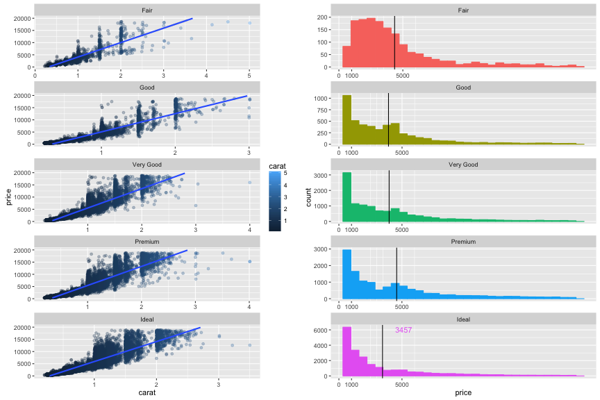
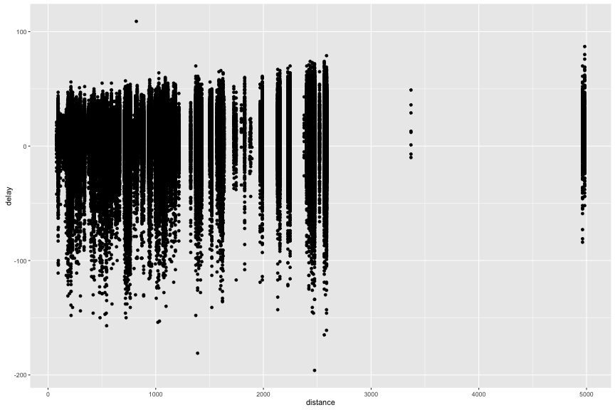
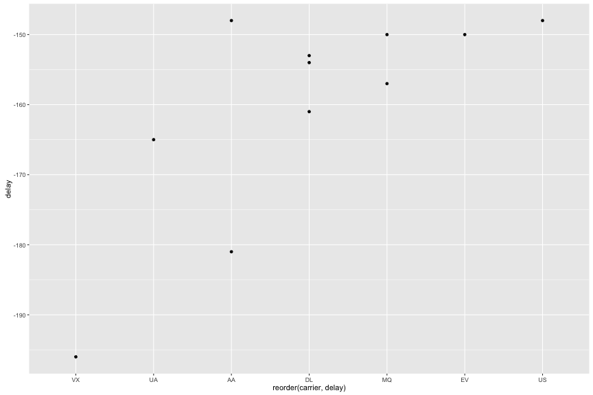

<style>
.footer {
    color: black;
    background: #E8E8E8;
    position: fixed;
    top: 90%;
    text-align:center;
    width:100%;
}

</style>


Große Daten analysieren mit dplyr
========================================================
author: Sebastian Sauer
date: 30. Juni 2016
width: 1400
height: 900
transition: rotate


Welches Werkzeug?
========================================================

<table>
 <thead>
  <tr>
   <th style="text-align:left;"> . </th>
   <th style="text-align:left;"> Excel </th>
   <th style="text-align:left;"> R </th>
   <th style="text-align:left;"> SQL </th>
  </tr>
 </thead>
<tbody>
  <tr>
   <td style="text-align:left;"> schon bekannt </td>
   <td style="text-align:left;"> X </td>
   <td style="text-align:left;">  </td>
   <td style="text-align:left;">  </td>
  </tr>
  <tr>
   <td style="text-align:left;"> kleine Daten (&lt;10^5 Zeilen) </td>
   <td style="text-align:left;"> X </td>
   <td style="text-align:left;"> X </td>
   <td style="text-align:left;">  </td>
  </tr>
  <tr>
   <td style="text-align:left;"> kleine große Daten (&lt;10 GB) </td>
   <td style="text-align:left;">  </td>
   <td style="text-align:left;"> X </td>
   <td style="text-align:left;">  </td>
  </tr>
  <tr>
   <td style="text-align:left;"> große Daten (&gt;10 GB) </td>
   <td style="text-align:left;">  </td>
   <td style="text-align:left;">  </td>
   <td style="text-align:left;"> X </td>
  </tr>
  <tr>
   <td style="text-align:left;"> automatisierbar </td>
   <td style="text-align:left;">  </td>
   <td style="text-align:left;"> X </td>
   <td style="text-align:left;"> X </td>
  </tr>
  <tr>
   <td style="text-align:left;"> transparent </td>
   <td style="text-align:left;">  </td>
   <td style="text-align:left;"> X </td>
   <td style="text-align:left;"> X </td>
  </tr>
  <tr>
   <td style="text-align:left;"> moderne Statistik </td>
   <td style="text-align:left;">  </td>
   <td style="text-align:left;"> X </td>
   <td style="text-align:left;">  </td>
  </tr>
  <tr>
   <td style="text-align:left;"> schöne Diagramme </td>
   <td style="text-align:left;">  </td>
   <td style="text-align:left;"> X </td>
   <td style="text-align:left;">  </td>
  </tr>
  <tr>
   <td style="text-align:left;"> Interaktive Applets </td>
   <td style="text-align:left;">  </td>
   <td style="text-align:left;"> X </td>
   <td style="text-align:left;">  </td>
  </tr>
  <tr>
   <td style="text-align:left;"> Open Code </td>
   <td style="text-align:left;">  </td>
   <td style="text-align:left;"> X </td>
   <td style="text-align:left;"> (X) </td>
  </tr>
</tbody>
</table>


Datenanalyse mit R
====



Anatomie der Datenanalyse
========================================================

- Zeilen filtern
- Spalten wählen
- Sortieren
- Zusammenfassen
- Verändern
- Gruppieren


Anatomie der Datenanalyse (Englisch)
========================================================

- Zeilen filtern -- **`filter`**
- Spalten wählen -- **`select`**
- Sortieren -- **`arrange`**
- Zusammenfassen -- **`summarise`**
- Verändern -- **`mutate`**
- Gruppieren -- **`group_by`**


R setup
======


```r
library(dplyr)
library(ggplot2)
library(nycflights13)

# install.packages(c("dplyr", "ggplot2", "nycflights13"))
```

<http://www.RStudio.com>


Daten sichten
=====


```r
glimpse(flights)
```

```
Observations: 336,776
Variables: 19
$ year           (int) 2013, 2013, 2013, 2013, 2013, 20...
$ month          (int) 1, 1, 1, 1, 1, 1, 1, 1, 1, 1, 1,...
$ day            (int) 1, 1, 1, 1, 1, 1, 1, 1, 1, 1, 1,...
$ dep_time       (int) 517, 533, 542, 544, 554, 554, 55...
$ sched_dep_time (int) 515, 529, 540, 545, 600, 558, 60...
$ dep_delay      (dbl) 2, 4, 2, -1, -6, -4, -5, -3, -3,...
$ arr_time       (int) 830, 850, 923, 1004, 812, 740, 9...
$ sched_arr_time (int) 819, 830, 850, 1022, 837, 728, 8...
$ arr_delay      (dbl) 11, 20, 33, -18, -25, 12, 19, -1...
$ carrier        (chr) "UA", "UA", "AA", "B6", "DL", "U...
$ flight         (int) 1545, 1714, 1141, 725, 461, 1696...
$ tailnum        (chr) "N14228", "N24211", "N619AA", "N...
$ origin         (chr) "EWR", "LGA", "JFK", "JFK", "LGA...
$ dest           (chr) "IAH", "IAH", "MIA", "BQN", "ATL...
$ air_time       (dbl) 227, 227, 160, 183, 116, 150, 15...
$ distance       (dbl) 1400, 1416, 1089, 1576, 762, 719...
$ hour           (dbl) 5, 5, 5, 5, 6, 5, 6, 6, 6, 6, 6,...
$ minute         (dbl) 15, 29, 40, 45, 0, 58, 0, 0, 0, ...
$ time_hour      (time) 2013-01-01 05:00:00, 2013-01-01...
```


Zeilen filtern mit filter()
======================

<div class="footer" style="font-size:120%;">
filter(mtcars, cyl == 8)<br>
</div>


Auszug aus `mtcars`

|                  |  mpg| cyl|  hp|    wt|
|:-----------------|----:|---:|---:|-----:|
|Mazda RX4         | 21.0|   6| 110| 2.620|
|Mazda RX4 Wag     | 21.0|   6| 110| 2.875|
|Datsun 710        | 22.8|   4|  93| 2.320|
|Hornet 4 Drive    | 21.4|   6| 110| 3.215|
|Hornet Sportabout | 18.7|   8| 175| 3.440|
|Valiant           | 18.1|   6| 105| 3.460|
|Duster 360        | 14.3|   8| 245| 3.570|
|Merc 240D         | 24.4|   4|  62| 3.190|
|Merc 230          | 22.8|   4|  95| 3.150|
|Merc 280          | 19.2|   6| 123| 3.440|

***
Spalten gefiltert:

|  mpg| cyl|  hp|   wt|
|----:|---:|---:|----:|
| 18.7|   8| 175| 3.44|
| 14.3|   8| 245| 3.57|


Beispiele für filter()
==============

Entschlüsseln Sie diese Filter:


```r
filter(mtcars, hp > 100)
filter(mtcars, cyl %in% c(4, 6))
filter(mtcars, gear == 3 | gear == 4)
filter(mtcars, hp > 300 & cyl == 8)
```


Übung zu filter()
=================

Identifizieren Sie folgende Flüge:

1. von JFK nach PWM (Portland)
2. von JFK nach PWM (Portland) im Januar
3. von JFK nach PWM (Portland) im Januar mit mehr als einer Stunde Verspätung
3. von JFK nach PWM (Portland) im Januar zwischen Mitternach und 5 Uhr
4. von JFK deren Ankunftsverspätung doppelt so groß war wie die Abflugverspätung, und die nach Atlanta geflogen sind


Lösungsideen
============

```r
filter(flights, origin == "JFK")

filter(flights, origin == "JFK" & month == 1)

filter(flights, origin == "JFK" & month == 1 & dep_time < 500 & dest == "PWM" )

filter(flights, origin == "JFK" & month == 1 & dep_time > 500 & dest == "PWM" )

filter(flights, origin == "JFK" & arr_delay > 2 * dep_delay & month == 1, dest == "ATL")
```


Spalten wählen mit select()
================

<div class="footer" style="font-size:120%;">
select(mtcars, mpg, cyl, hp)<br>
</div>


Auszug aus `mtcars`

|                  |  mpg| cyl|  hp| disp|    wt|  qsec|
|:-----------------|----:|---:|---:|----:|-----:|-----:|
|Mazda RX4         | 21.0|   6| 110|  160| 2.620| 16.46|
|Mazda RX4 Wag     | 21.0|   6| 110|  160| 2.875| 17.02|
|Datsun 710        | 22.8|   4|  93|  108| 2.320| 18.61|
|Hornet 4 Drive    | 21.4|   6| 110|  258| 3.215| 19.44|
|Hornet Sportabout | 18.7|   8| 175|  360| 3.440| 17.02|
|Valiant           | 18.1|   6| 105|  225| 3.460| 20.22|

***
Spalten gefiltert:

|                  |  mpg| cyl|  hp|
|:-----------------|----:|---:|---:|
|Mazda RX4         | 21.0|   6| 110|
|Mazda RX4 Wag     | 21.0|   6| 110|
|Datsun 710        | 22.8|   4|  93|
|Hornet 4 Drive    | 21.4|   6| 110|
|Hornet Sportabout | 18.7|   8| 175|
|Valiant           | 18.1|   6| 105|


Übung zu select
==============

Lesen Sie die Hilfe zu `select`. Auf welche Arten kann man noch Spalten (Variablen auswählen?)

Schreiben Sie 3 Arten auf, um die Spalten mit den Verzögerungen auszuwählen.


Lösungsideen
============


```r
select(flights, arr_delay, dep_delay)
select(flights, arr_delay:dep_delay)
select(flights, contains("delay"))
select(flights, ends_with("delay"))
select(flights, c(6, 9))
auswahl <- c("dep_delay", "arr_delay")
select(flights, one_of(auswahl))
```


Zeilen sortieren mit arrange()
=============


<div class="footer" style="font-size:120%;">
arrange(mtcars, cyl)<br>
</div>


Auszug aus `mtcars`

|                  |  mpg| cyl|  hp| disp|    wt|  qsec|
|:-----------------|----:|---:|---:|----:|-----:|-----:|
|Mazda RX4         | 21.0|   6| 110|  160| 2.620| 16.46|
|Mazda RX4 Wag     | 21.0|   6| 110|  160| 2.875| 17.02|
|Datsun 710        | 22.8|   4|  93|  108| 2.320| 18.61|
|Hornet 4 Drive    | 21.4|   6| 110|  258| 3.215| 19.44|
|Hornet Sportabout | 18.7|   8| 175|  360| 3.440| 17.02|
|Valiant           | 18.1|   6| 105|  225| 3.460| 20.22|

***
Zeilen *aufsteigend* sortiert nach `cyl` und nach `hp`:

|  mpg| cyl|  hp|
|----:|---:|---:|
| 22.8|   4|  93|
| 18.1|   6| 105|
| 21.0|   6| 110|
| 21.0|   6| 110|
| 21.4|   6| 110|
| 18.7|   8| 175|


Zeilen absteigend sortieren mit arrange(desc())
=============


<div class="footer" style="font-size:120%;">
select(mtcars, arrange(desc(cyl)))<br>
</div>


Auszug aus `mtcars`

|                  |  mpg| cyl|  hp| disp|    wt|  qsec|
|:-----------------|----:|---:|---:|----:|-----:|-----:|
|Mazda RX4         | 21.0|   6| 110|  160| 2.620| 16.46|
|Mazda RX4 Wag     | 21.0|   6| 110|  160| 2.875| 17.02|
|Datsun 710        | 22.8|   4|  93|  108| 2.320| 18.61|
|Hornet 4 Drive    | 21.4|   6| 110|  258| 3.215| 19.44|
|Hornet Sportabout | 18.7|   8| 175|  360| 3.440| 17.02|
|Valiant           | 18.1|   6| 105|  225| 3.460| 20.22|

***
Zeilen *absteigend* sortiert nach `cyl`:

|  mpg| cyl|  hp|
|----:|---:|---:|
| 18.7|   8| 175|
| 21.0|   6| 110|
| 21.0|   6| 110|
| 21.4|   6| 110|
| 18.1|   6| 105|
| 22.8|   4|  93|


Übung zu arrange()
==================

1. Ordnen Sie die Flüge nach Datum und Uhrzeit.
2. Welche Flüge hatten die größte Verspätung?
4. Welche Flüge holten die meiste Verspätung während des Fluges auf?

3. Welche Airlines hatten die größte Verspätung? Hm.


Lösungsideen
===========


```r
arrange(flights, month, day, sched_dep_time)
flights2 <- select(flights, dep_delay, arr_delay, tailnum, flight, dest)
arrange(flights2, desc(dep_delay))
arrange(flights2, desc(dep_delay - arr_delay))
```


Variablen (und ihre Werte) verändern
================
<div class="footer" style="font-size:120%;">
mutate(flights, wt_kg = wt / 1000 * 2, wt_per_ps = wt_kg / hp)
<br>
</div>


Auszug aus `mtcars`

|                  |  mpg| cyl|  hp| disp|    wt|  qsec|
|:-----------------|----:|---:|---:|----:|-----:|-----:|
|Mazda RX4         | 21.0|   6| 110|  160| 2.620| 16.46|
|Mazda RX4 Wag     | 21.0|   6| 110|  160| 2.875| 17.02|
|Datsun 710        | 22.8|   4|  93|  108| 2.320| 18.61|
|Hornet 4 Drive    | 21.4|   6| 110|  258| 3.215| 19.44|
|Hornet Sportabout | 18.7|   8| 175|  360| 3.440| 17.02|
|Valiant           | 18.1|   6| 105|  225| 3.460| 20.22|

***
Neue Spalte: Gewicht (`wt`) pro PS (`hp`)

|    wt|  mpg| cyl|  hp|  wt_kg| wt_per_ps|
|-----:|----:|---:|---:|------:|---------:|
| 2.620| 21.0|   6| 110| 1310.0| 11.909091|
| 2.875| 21.0|   6| 110| 1437.5| 13.068182|
| 2.320| 22.8|   4|  93| 1160.0| 12.473118|
| 3.215| 21.4|   6| 110| 1607.5| 14.613636|
| 3.440| 18.7|   8| 175| 1720.0|  9.828571|
| 3.460| 18.1|   6| 105| 1730.0| 16.476191|


Übung zu mutate()
================


1. Berechnen Sie die Geschwindigkeit (mph) jedes Fluges. Welche Flüge flogen am schnellsten?
2. Erzeugen Sie eine neue Variable, die angibt, wieviel Zeit ein Flug verloren oder aufgeholt hat.
3. Berechnen Sie die Flugdistanz in km.


Lösungsideen
==============


```r
mutate(flights, speed = distance / air_time)
arrange(flights, speed)
mutate(flights, delay = dep_delay - arr_delay)
mutate(flights, dist_km = distance / 1.6)
```


Zusammenfassen mit summarise()
==========

<div class="footer" style="font-size:120%;">
summarise(flights, hp_mean = mean(hp))
<br>
</div>


|                  |  mpg| cyl|  hp| disp|
|:-----------------|----:|---:|---:|----:|
|Mazda RX4         | 21.0|   6| 110|  160|
|Mazda RX4 Wag     | 21.0|   6| 110|  160|
|Datsun 710        | 22.8|   4|  93|  108|
|Hornet 4 Drive    | 21.4|   6| 110|  258|
|Hornet Sportabout | 18.7|   8| 175|  360|
|Valiant           | 18.1|   6| 105|  225|

***
Zusammenfassung der Spalte `hp` in einen einzigen Wert (Auszug)

|  hp_mean|
|--------:|
| 117.1667|


Gruppieren und zusammenfassen mit summarise()
==========

<div class="footer" style="font-size:120%;">
mtcars_by_cyl = group_by(mtcars, cyl) <br>
summarise(mtcars_by_cyl, hp_cyl_mean = mean(hp))
<br>
</div>


Gruppieren nach `cyl` (und in einem data.frame ausgeben):

|                  |  mpg| cyl|  hp| disp|
|:-----------------|----:|---:|---:|----:|
|Mazda RX4         | 21.0|   6| 110|  160|
|Mazda RX4 Wag     | 21.0|   6| 110|  160|
|Datsun 710        | 22.8|   4|  93|  108|
|Hornet 4 Drive    | 21.4|   6| 110|  258|
|Hornet Sportabout | 18.7|   8| 175|  360|
|Valiant           | 18.1|   6| 105|  225|

***
Zusammenfassen der Spalte `hp` *bei jeder Gruppe* in einen einzigen Wert

| cyl| hp_cyl_mean|
|---:|-----------:|
|   4|       93.00|
|   6|      108.75|
|   8|      175.00|


Zusammenfassungsfunktionen
=========================

- `min()`, `max()`, `median()`, `quantile()`
- `mean()`, `sd()`, `sum()`
- `n()`, `n_distinct()`
- Jede Funktion, die eine Spalte als Input nimmt und einen einzelnen Wert ausgibt


Übung zu summarise() nach group_by()
===========
1. Berechnen Sie die mittlere Verspätung pro Flughafen!
2. Ermitteln Sie pro Monat den Flug mit der größten Verspätung!
3. Geben Sie die Airlines mit der geringsten mittleren Verspätung an!


Lösungsideen
============
1\. Berechnen Sie die mittlere Verspätung pro Flughafen!

```r
f2 <-  group_by(flights, origin)
f3 <- mutate(f2, delay = dep_delay - arr_delay)
summarise(f3, delay_mean = mean(delay, na.rm = TRUE))
```

2\. Ermitteln Sie pro Monat den Flug mit der größten Verspätung!

```r
f2 <- group_by(flights, month)
f3 <- mutate(f2, delay = dep_delay - arr_delay)
summarise(f3, delay_max = max(delay, na.rm = T))
```

3\. Geben Sie die Airlines mit der geringsten mittleren Verspätung an!

```r
f2 <- group_by(flights, carrier)
f3 <- mutate(f2, delay = dep_delay - arr_delay)
f4 <- filter(f3, !is.na(delay))
f5 <- summarise(f4, delay_min = mean(delay))
arrange(f5, delay_min)
```


Verschachtelte Syntax ist schwer zu lesen
==============

```r
hourly_delay <- filter(
  summarise(
    group_by(
      filter(
flights,
        !is.na(dep_delay)
      ),
date, hour ),
    delay = mean(dep_delay),
n = n() ),
n > 10 )
```


Die Pfeife %>%
==============

- Das ist keine Pfeife `{magrittr}`
- x `%>% f(y) -> f(x, y)


```r
hourly_delay <- flights %>%
  filter(!is.na(dep_delay)) %>%
  group_by(date, hour) %>%
  summarise(delay = mean(dep_delay), n = n()) %>%
  filter(n > 10)
```

- Tipp: `%>%` kann man lesen als "*und dann*"


Übung zur Pfeife
================

4. Was sind die oberen 10% der Airlines bei der Verspätung?
5. Berechnen Sie die mittlere Verspätung aller Flüge mit deutlicher Verspätung (> 1 Stunde)!


Lösungsideen
============
 Was sind die oberen 10% der Airlines bei der Verspätung?

```r
flights %>%
  group_by(carrier) %>%
  na.omit() %>%
  mutate(delay = dep_delay - arr_delay) %>%
  summarise(delay_mean = mean(delay, na.rm = TRUE)) %>%
  filter(delay_mean < quantile(delay_mean, .1)) %>%
  # oder: filter(ntile(delay_mean, 10) == 1) %>%
  arrange(delay_mean)
```
Berechnen Sie die mittlere Verspätung aller Flüge mit deutlicher Verspätung (> 1 Stunde)!

```r
flights %>%
  na.omit() %>%
  mutate(delay = dep_delay - arr_delay) %>%
  filter(delay > 60) %>%
  summarise(delay_mean = mean(delay),
            n = n()) %>%  # Anzahl
  arrange(delay_mean)
```


Diagramme
=========
type:section


Hängen Flugzeit und Verspätung zusammen?
===============


```r
flights %>%
  mutate(delay = dep_delay - arr_delay) %>%
  na.omit() %>%
  qplot(x = distance, y = delay, data = .)
```




Was ist die Top-10 der lahmen Airlines?
===================


```r
flights %>%
  group_by(carrier) %>%
  na.omit() %>%
  mutate(delay = dep_delay - arr_delay) %>%
  ungroup() %>%
  filter(min_rank(delay) < 11) %>%
  arrange(delay) %>%
  qplot(data = ., x = reorder(carrier, delay), y = delay,
        geom = c("point"))
```




