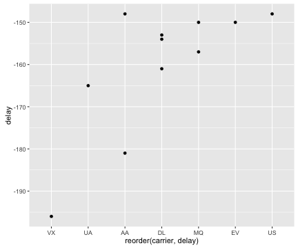

<style>
strong {
  font-weight: bold;
}
</style>


<style>
em {
  font-style: italic
}
</style>


## Was machen wir heute? Und warum?


**WAS**:
- Vertraut machen mit einem schönem **Werkzeug** zur **praktischen Datenanalyse** (`dplyr`)
- Einüben von **explorativer** ("praktischer") **Analyse** von **ziemlich großen Daten**  


**WARUM**:
- Datenanalyse in Wissenschaft und Praxis besteht zum **großen Teil** im **Aufbereiten** und **Explorieren** des Datensatzes
- Die **Größe** von Datensätzen **steigt** schnell
- Wer den Schritt vom Gelegenheitsspieler zum **Routinetäter** gehen will, braucht **Profi-Werkzeug**

---


## Excel oder R oder ...?


|.                           |Excel |R  |SQL |
|:---------------------------|:-----|:--|:---|
|schon bekannt               |X     |   |    |
|kleine Daten (<10^5 Zeilen) |X     |X  |    |
|kleine große Daten (<10 GB) |      |X  |    |
|große Daten (>10 GB)        |      |   |X   |
|automatisierbar             |      |X  |X   |
|transparent                 |      |X  |X   |
|moderne Statistik           |      |X  |    |
|schöne Diagramme            |      |X  |    |
|Interaktive Applets         |      |X  |    |
|Open Code                   |      |X  |(X) |

---


## R: Die neuesten Tools, elegante Diagramme


---

## Prozess der Datenanalyse


Quelle: [https://github.com/rstudio/RStartHere/blob/master/data-science.png?raw=true](https://github.com/rstudio/RStartHere/blob/master/data-science.png?raw=true)

---


## Big Data?


---


## Anatomie der Datenanalyse
Mit einer handvoll Verben lassen sich die meisten Aufgaben der Datenanalyse erfassen:


- Zeilen filtern -- **`filter`**
- Spalten wählen -- **`select`**
- Sortieren -- **`arrange`**
- Zusammenfassen -- **`summarise`**
- Verändern -- **`mutate`**
- Gruppieren -- **`group_by`**

---


## `dplyr` stellt die "Analyse-Verben" zur Verfügung
[Cheatsheet](https://www.rstudio.com/wp-content/uploads/2015/02/data-wrangling-cheatsheet.pdf)


---


## Diese Software brauchen wir
- [R](https://cran.r-project.org)


```r
# packages müssen einmalig installiert sein, bevor Sie sie laden können
# update.packages()  # zur Sicherheit auf den neuesten Stand kommen
# install.packages(c("dplyr", "ggplot2", "nycflights13"))

library(dplyr)
library(ggplot2)
library(nycflights13)
data(flights)  # lädt Datensatz
?flights  # Beschreibung des Datensatzes
```

- Installieren Sie [RStudio](http://www.RStudio.com).

- Alternativ kann man den Datensatz `flights` auch [hier](https://s3-us-west-2.amazonaws.com/sparkr-data/nycflights13.csv) herunterladen.

- Excel-Freaks: Verfolgt die Analyse parallel in Excel mit!

---


## glimpse(flights)

```
## Observations: 336,776
## Variables: 19
## $ year           (int) 2013, 2013, 2013, 2013, 2013, 20...
## $ month          (int) 1, 1, 1, 1, 1, 1, 1, 1, 1, 1, 1,...
## $ day            (int) 1, 1, 1, 1, 1, 1, 1, 1, 1, 1, 1,...
## $ dep_time       (int) 517, 533, 542, 544, 554, 554, 55...
## $ sched_dep_time (int) 515, 529, 540, 545, 600, 558, 60...
## $ dep_delay      (dbl) 2, 4, 2, -1, -6, -4, -5, -3, -3,...
## $ arr_time       (int) 830, 850, 923, 1004, 812, 740, 9...
## $ sched_arr_time (int) 819, 830, 850, 1022, 837, 728, 8...
## $ arr_delay      (dbl) 11, 20, 33, -18, -25, 12, 19, -1...
## $ carrier        (chr) "UA", "UA", "AA", "B6", "DL", "U...
## $ flight         (int) 1545, 1714, 1141, 725, 461, 1696...
## $ tailnum        (chr) "N14228", "N24211", "N619AA", "N...
## $ origin         (chr) "EWR", "LGA", "JFK", "JFK", "LGA...
## $ dest           (chr) "IAH", "IAH", "MIA", "BQN", "ATL...
## $ air_time       (dbl) 227, 227, 160, 183, 116, 150, 15...
## $ distance       (dbl) 1400, 1416, 1089, 1576, 762, 719...
## $ hour           (dbl) 5, 5, 5, 5, 6, 5, 6, 6, 6, 6, 6,...
## $ minute         (dbl) 15, 29, 40, 45, 0, 58, 0, 0, 0, ...
## $ time_hour      (time) 2013-01-01 05:00:00, 2013-01-01...
```

--- 

## Der Datensatz `mtcars`

- Ein Datensatz zu technischen Merkmalen von Autos aus der US-Zeitschrift *Motor Trends*.

- Wir benutzen als "Spielzeug-Datensatz" (XXS-Data)

- Der Datensatz ist in R schon enthalten.

Sehen Sie sich die Hilfe zu dem Datensatz an:

```r
?mtcars
```


--- &twocol


## Zeilen filtern mit filter()

*** =left
Auszug aus `mtcars`:

|                  |  mpg| cyl|  hp|    wt|
|:-----------------|----:|---:|---:|-----:|
|Mazda RX4         | 21.0|   6| 110| 2.620|
|Mazda RX4 Wag     | 21.0|   6| 110| 2.875|
|Datsun 710        | 22.8|   4|  93| 2.320|
|Hornet 4 Drive    | 21.4|   6| 110| 3.215|
|Hornet Sportabout | 18.7|   8| 175| 3.440|
|Valiant           | 18.1|   6| 105| 3.460|
|Duster 360        | 14.3|   8| 245| 3.570|
|Merc 240D         | 24.4|   4|  62| 3.190|
|Merc 230          | 22.8|   4|  95| 3.150|
|Merc 280          | 19.2|   6| 123| 3.440|


*** =right

Spalten gefiltert mit `cyl == 8`:

|  mpg| cyl|  hp|   wt|
|----:|---:|---:|----:|
| 18.7|   8| 175| 3.44|
| 14.3|   8| 245| 3.57|


---


## Beispiele für filter()

Entschlüsseln Sie diese Filter (Datensatz `flights`):


```r
filter(mtcars, hp > 100)
filter(mtcars, cyl %in% c(4, 6))
filter(mtcars, gear == 3 | gear == 4)
filter(mtcars, hp > 300 & cyl == 8)
```

---

## Übung zu filter()

Identifizieren Sie folgende Flüge:

1. von JFK nach PWM (Portland)
2. von JFK nach PWM (Portland) im Januar
3. von JFK nach PWM (Portland) im Januar mit mehr als einer Stunde Verspätung
3. von JFK nach PWM (Portland) im Januar zwischen Mitternach und 5 Uhr
4. von JFK deren Ankunftsverspätung doppelt so groß war wie die Abflugverspätung, und die nach Atlanta geflogen sind

---

## Lösungsideen


```r
filter(flights, origin == "JFK")

filter(flights, origin == "JFK" & month == 1)

filter(flights, origin == "JFK" & month == 1 & dep_time < 500 & dest == "PWM" )

filter(flights, origin == "JFK" & month == 1 & dep_time > 500 & dest == "PWM" )

filter(flights, origin == "JFK" & arr_delay > 2 * dep_delay & month == 1, dest == "ATL")
```

--- &twocol


## Spalten wählen mit select()

`select(mtcars, mpg, cyl, hp)`


*** =left
Auszug aus `mtcars`:

|                  |  mpg| cyl|  hp| disp|    wt|  qsec|
|:-----------------|----:|---:|---:|----:|-----:|-----:|
|Mazda RX4         | 21.0|   6| 110|  160| 2.620| 16.46|
|Mazda RX4 Wag     | 21.0|   6| 110|  160| 2.875| 17.02|
|Datsun 710        | 22.8|   4|  93|  108| 2.320| 18.61|
|Hornet 4 Drive    | 21.4|   6| 110|  258| 3.215| 19.44|
|Hornet Sportabout | 18.7|   8| 175|  360| 3.440| 17.02|
|Valiant           | 18.1|   6| 105|  225| 3.460| 20.22|

*** =right
Spalten ausgewählt mit `select(mtcars, mgp, cyl, hp)`:

|                  |  mpg| cyl|  hp|
|:-----------------|----:|---:|---:|
|Mazda RX4         | 21.0|   6| 110|
|Mazda RX4 Wag     | 21.0|   6| 110|
|Datsun 710        | 22.8|   4|  93|
|Hornet 4 Drive    | 21.4|   6| 110|
|Hornet Sportabout | 18.7|   8| 175|
|Valiant           | 18.1|   6| 105|

---

## Übung zu select

- Lesen Sie die Hilfe zu `select()`. Auf welche Arten kann man noch Spalten (Variablen) auswählen?

- Schreiben Sie 3 Arten auf, um die Spalten mit den Verzögerungen auszuwählen.

- Stellen Sie sich vor, Sie haben einen Datensatz mit 1000 Spalten: V1 .. V1000. Inwiefern ist das mit Excel noch praktibel?

---


## Lösungsideen


```r
select(flights, arr_delay, dep_delay)

select(flights, arr_delay:dep_delay)

select(flights, contains("delay"))

select(flights, ends_with("delay"))

select(flights, c(6, 9))

auswahl <- c("dep_delay", "arr_delay")
select(flights, one_of(auswahl))
```

--- &twocol


## Zeilen sortieren mit arrange()

`arrange(mtcars, cyl)`


*** =left
Auszug aus `mtcars`:

|                  |  mpg| cyl|  hp| disp|    wt|  qsec|
|:-----------------|----:|---:|---:|----:|-----:|-----:|
|Mazda RX4         | 21.0|   6| 110|  160| 2.620| 16.46|
|Mazda RX4 Wag     | 21.0|   6| 110|  160| 2.875| 17.02|
|Datsun 710        | 22.8|   4|  93|  108| 2.320| 18.61|
|Hornet 4 Drive    | 21.4|   6| 110|  258| 3.215| 19.44|
|Hornet Sportabout | 18.7|   8| 175|  360| 3.440| 17.02|
|Valiant           | 18.1|   6| 105|  225| 3.460| 20.22|

*** =right
Zeilen *aufsteigend* sortiert nach `cyl` und nach `hp`:

|  mpg| cyl|  hp|
|----:|---:|---:|
| 22.8|   4|  93|
| 18.1|   6| 105|
| 21.0|   6| 110|
| 21.0|   6| 110|
| 21.4|   6| 110|
| 18.7|   8| 175|

--- &twocol


## Zeilen absteigend sortieren mit arrange(desc())

`select(mtcars, arrange(desc(cyl)))` ("descending": engl. für absteigend)


*** =left 
Auszug aus `mtcars`:

|                  |  mpg| cyl|  hp| disp|    wt|  qsec|
|:-----------------|----:|---:|---:|----:|-----:|-----:|
|Mazda RX4         | 21.0|   6| 110|  160| 2.620| 16.46|
|Mazda RX4 Wag     | 21.0|   6| 110|  160| 2.875| 17.02|
|Datsun 710        | 22.8|   4|  93|  108| 2.320| 18.61|
|Hornet 4 Drive    | 21.4|   6| 110|  258| 3.215| 19.44|
|Hornet Sportabout | 18.7|   8| 175|  360| 3.440| 17.02|
|Valiant           | 18.1|   6| 105|  225| 3.460| 20.22|

*** =right
Zeilen **absteigend** sortiert nach `cyl`:

|  mpg| cyl|  hp|
|----:|---:|---:|
| 18.7|   8| 175|
| 21.0|   6| 110|
| 21.0|   6| 110|
| 21.4|   6| 110|
| 18.1|   6| 105|
| 22.8|   4|  93|

---


## Übung zu arrange()

1. Ordnen Sie die Flüge nach Datum und Uhrzeit.
2. Welche Flüge hatten die größte Verspätung?
4. Welche Flüge holten die meiste Verspätung während des Fluges auf?

3. Welche Airlines hatten die größte Verspätung? Hm.

---

## Lösungsideen


```r
arrange(flights, month, day, sched_dep_time)

flights2 <- select(flights, dep_delay, arr_delay, tailnum, flight, dest)

arrange(flights2, desc(dep_delay))

arrange(flights2, desc(dep_delay - arr_delay))
```

--- &twocol


## Variablen (und ihre Werte) verändern
`mutate(flights, wt_kg = wt / 1000 * 2, wt_per_ps = wt_kg / hp)`

*** =left
Auszug aus `mtcars`:

|                  |  mpg| cyl|  hp| disp|    wt|  qsec|
|:-----------------|----:|---:|---:|----:|-----:|-----:|
|Mazda RX4         | 21.0|   6| 110|  160| 2.620| 16.46|
|Mazda RX4 Wag     | 21.0|   6| 110|  160| 2.875| 17.02|
|Datsun 710        | 22.8|   4|  93|  108| 2.320| 18.61|
|Hornet 4 Drive    | 21.4|   6| 110|  258| 3.215| 19.44|
|Hornet Sportabout | 18.7|   8| 175|  360| 3.440| 17.02|
|Valiant           | 18.1|   6| 105|  225| 3.460| 20.22|

*** =right
Neue Spalte `wt_per_ps`: Gewicht (`wt`) pro PS (`hp`):

|    wt|  mpg| cyl|  hp|  wt_kg| wt_per_ps|
|-----:|----:|---:|---:|------:|---------:|
| 2.620| 21.0|   6| 110| 1310.0| 11.909091|
| 2.875| 21.0|   6| 110| 1437.5| 13.068182|
| 2.320| 22.8|   4|  93| 1160.0| 12.473118|
| 3.215| 21.4|   6| 110| 1607.5| 14.613636|
| 3.440| 18.7|   8| 175| 1720.0|  9.828571|
| 3.460| 18.1|   6| 105| 1730.0| 16.476191|

---

## Übung zu mutate()

1. Berechnen Sie die Geschwindigkeit (mph) jedes Fluges. Welche Flüge flogen am schnellsten?
2. Erzeugen Sie eine neue Variable, die angibt, wieviel Zeit ein Flug verloren oder aufgeholt hat.
3. Berechnen Sie die Flugdistanz in km.

---


## Lösungsideen


```r
mutate(flights, speed = distance / air_time)
arrange(flights, speed)
mutate(flights, delay = dep_delay - arr_delay)
mutate(flights, dist_km = distance / 1.6)
```

--- &twocol


## Zusammenfassen mit summarise()


`summarise(flights, hp_mean = mean(hp))`

*** =left

|                  |  mpg| cyl|  hp| disp|
|:-----------------|----:|---:|---:|----:|
|Mazda RX4         | 21.0|   6| 110|  160|
|Mazda RX4 Wag     | 21.0|   6| 110|  160|
|Datsun 710        | 22.8|   4|  93|  108|
|Hornet 4 Drive    | 21.4|   6| 110|  258|
|Hornet Sportabout | 18.7|   8| 175|  360|
|Valiant           | 18.1|   6| 105|  225|

*** =right
Zusammenfassung der Spalte `hp` in einen einzigen Wert (Mittelwert):

|  hp_mean|
|--------:|
| 117.1667|

--- &twocol


## Gruppieren plus zusammenfassen mit summarise()

`mtcars_by_cyl = group_by(mtcars, cyl)`

`summarise(mtcars_by_cyl, p_cyl_mean = mean(hp, na.rm = TRUE))`

*** =left
Gruppieren nach `cyl` (und in einem data.frame ausgeben):

|                  |  mpg| cyl|  hp| disp|
|:-----------------|----:|---:|---:|----:|
|Mazda RX4         | 21.0|   6| 110|  160|
|Mazda RX4 Wag     | 21.0|   6| 110|  160|
|Datsun 710        | 22.8|   4|  93|  108|
|Hornet 4 Drive    | 21.4|   6| 110|  258|
|Hornet Sportabout | 18.7|   8| 175|  360|
|Valiant           | 18.1|   6| 105|  225|

*** =right
Zusammenfassen der Spalte `hp` *bei jeder Gruppe* in einen einzigen Wert:

| cyl| hp_cyl_mean|
|---:|-----------:|
|   4|       93.00|
|   6|      108.75|
|   8|      175.00|

---


## Funktionen zum Zusammenfassen


- `min()`, `max()`, `median()`, `quantile()`
- `mean()`, `sd()`, `sum()`
- `n()`, `n_distinct()`
- ...
- *Jede* Funktion, die eine *Spalte* als *Input* nimmt und einen *einzelnen Wert ausgibt*

---


## Übung zu summarise() nach group_by()

1. Berechnen Sie die mittlere Verspätung pro Flughafen!
2. Ermitteln Sie pro Monat den Flug mit der größten Verspätung!
3. Geben Sie die Airlines mit der geringsten mittleren Verspätung an!

---

## Lösungsideen
1\. Berechnen Sie die mittlere Verspätung pro Flughafen!

```r
f2 <-  group_by(flights, origin)
f3 <- mutate(f2, delay = dep_delay - arr_delay)
summarise(f3, delay_mean = mean(delay, na.rm = TRUE))
```
2\. Ermitteln Sie pro Monat den Flug mit der größten Verspätung!

```r
f2 <- group_by(flights, month)
f3 <- mutate(f2, delay = dep_delay - arr_delay)
summarise(f3, delay_max = max(delay, na.rm = T))
```
3\. Geben Sie die Airlines mit der geringsten mittleren Verspätung an!

```r
f2 <- group_by(flights, carrier)
f3 <- mutate(f2, delay = dep_delay - arr_delay)
f4 <- filter(f3, !is.na(delay))
f5 <- summarise(f4, delay_min = mean(delay))
arrange(f5, delay_min)
```

---

## Verschachtelte Syntax ist schwer zu lesen


```r
hourly_delay <- filter(
  summarise(
    group_by(
      filter(
flights,
        !is.na(dep_delay)
      ),
date, hour ),
    delay = mean(dep_delay),
n = n() ),
n > 10 )
```

---

## Die Pfeife %>%

- [Das ist keine Pfeife](http://collections.lacma.org/node/239578) `{magrittr}`
- `x %>% f(y)` ist dasselbe wie `f(x, y)`


```r
hourly_delay <- flights %>%
  filter(!is.na(dep_delay)) %>%
  group_by(date, hour) %>%
  summarise(delay = mean(dep_delay), n = n()) %>%
  filter(n > 10)
```

- Tipp: `%>%` kann man lesen als "*und dann*"

---

## Übung zur Pfeife


4. Was sind die oberen 10% der Airlines bei der Verspätung?
5. Berechnen Sie die mittlere Verspätung aller Flüge mit deutlicher Verspätung (> 1 Stunde)!

---

## Lösungsideen

 Was sind die oberen 10% der Airlines bei der Verspätung?

```r
flights %>%
  group_by(carrier) %>% na.omit() %>%
  mutate(delay = dep_delay - arr_delay) %>%
  summarise(delay_mean = mean(delay, na.rm = TRUE)) %>%
  filter(delay_mean < quantile(delay_mean, .1)) %>%
  # oder: filter(ntile(delay_mean, 10) == 1) %>%
  arrange(delay_mean)
```
Berechnen Sie die mittlere Verspätung aller Flüge mit deutlicher Verspätung (> 1 Stunde)!

```r
flights %>%  na.omit() %>%  mutate(delay = dep_delay - arr_delay) %>%
  filter(delay > 60) %>%
  summarise(delay_mean = mean(delay),
            n = n()) %>%  # Anzahl
  arrange(delay_mean)
```

--- 

## Wie sind die Verspätungen verteilt?


```r
f2 <- flights %>% 
   na.omit() %>% mutate(delay = dep_delay - arr_delay) 

  qplot(data = f2, x = delay,
        main = paste("Delays [min]: Min: ", min(f2$delay),
                     "; Max: ", max(f2$delay),
                     "; Md: ", median(f2$delay), sep = ""))
```


---


## Hängen Flugzeit und Verspätung zusammen?


```r
flights %>%
  mutate(delay = dep_delay - arr_delay) %>%
  na.omit() %>% qplot(x = distance, y = delay, data = .) 
```


--- 


## Was ist die Top-10 der lahmen Airlines?


```r
flights %>%
  group_by(carrier) %>% na.omit() %>% mutate(delay = dep_delay - arr_delay) %>%
  ungroup() %>% filter(min_rank(delay) < 11) %>%
  arrange(delay) %>% qplot(data = ., x = reorder(carrier, delay), y = delay,
        geom = "point")
```




---


## Danke/Referenzen

- Danke an Hadley Wickham für `dplyr`, `ggplot2` und das Hadleyverse
- Dieser Kurs basiert auf [diesem](https://www.dropbox.com/sh/i8qnluwmuieicxc/AAAgt9tIKoIm7WZKIyK25lh6a) Tutorial 
von Hadley Wickham
- Kontakt: Sebastian Sauer, sebastian.sauer-AT-fom.de
- Die Folien (inkl. Syntax) findet sich [hier](https://github.com/sebastiansauer/dplyr_WS)


